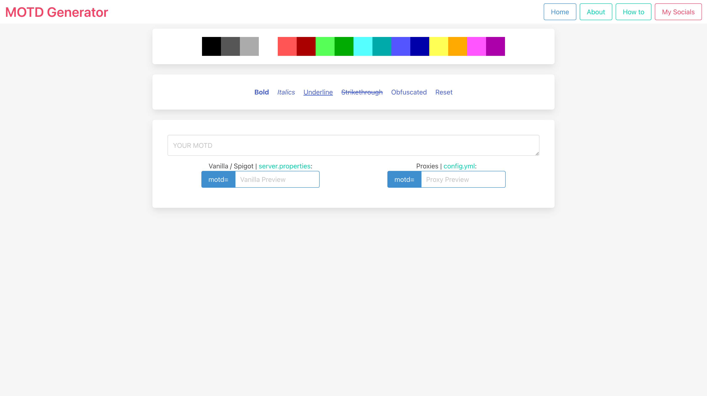

# MOTD Generator

**Spectrasonic** Fork

Original [Project](https://github.com/notKimu/Simple-MOTD) by [**Kimu**](https://github.com/notKimu)



## Packages:

-   Bun
-   BulmaCSS

> Trying a project using bun and BulmaCSS

### To install
```sh
bun install
```
### To execute
```sh
bun run dev
```

---

 <p align='right'> with  by <strong>Spectrasonic</strong></p>
